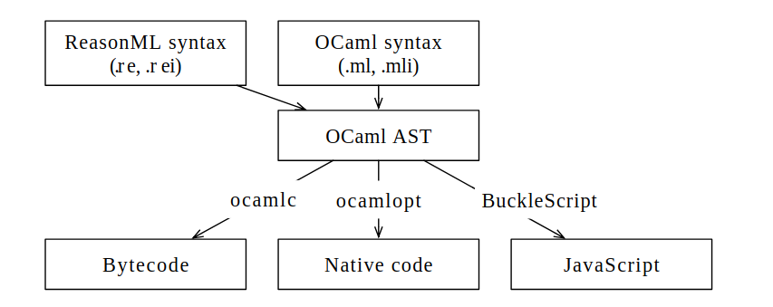

# [Reason语言](https://reasonml.github.io/)
> 本书《深入Reason语言》由社区人员参与书写，[欢迎加入](https://github.com/ouisrc/Important/issues/1)。Reason中文QQ群：550177672

> 本书中部分内容来源于英文网络包括不限于[ReasonDocs](https://reasonml.github.io/docs/en/what-and-why)，[Exploring ReasonML](http://reasonmlhub.com/exploring-reasonml/toc.html)

> 本书由社区人员参与书写，[欢迎加入](https://github.com/ouisrc/Important/issues/1)。Reason中文QQ群：550177672

> 本书中内容有来源于英文网络包括不限于[Exploring ReasonML](http://reasonmlhub.com/exploring-reasonml/toc.html)

## 什么是ReasonML

ReasonML是由Facebook设计的一门基于对象的函数式编程语言。实质上，他是在OCaml这门编程语言基础上，创造的一门新的类C语法的语言。这种新的语法旨在实现与js互通以及让js开发者更容易上手,同时facebook正在打造编译到原生机器码的工具链。此外，也去除了一些OCaml独有的奇特的语法。ReasonML同时还支持了JSX（React所使用的一种将html模板内置于js的语法）。由于ReasonML基于OCaml，许多人可以互换地使用这两个名称。下图显示了ReasonML如何适应OCaml生态系统。



这就是ReasonML如何适应OCaml生态系统。

> 目前，ReasonML的默认编译目标是JavaScript（browsers和Node.js）。

这就是ReasonML代码的样子：

```reason
type color = Red | Green | Blue;

let stringOfColor = (c) =>
  switch (c) {
  | Red => "Red"
  | Green => "Green"
  | Blue => "Blue"
  };
```

有几点值得注意：

- 语法的许多元素都来自JavaScript。例如：
  - switch名称（OCaml的：match）
  - (x) => ···函数的语法
  - 分号
- 其他元素是函数式编程语言的典型元素。例如：
  - color是一种[变体类型](http://reasonmlhub.com/exploring-reasonml/ch_variants.html)
  - switch 执行模式匹配
- 不需要类型注释

## OCaml的好处

ReasonML的基础OCaml带来以下好处：

- 它是一种成熟的语言（创建于1996年），已在许多项目中得到证明。Facebook本身正在几个项目中使用它（例如Flow）。
- 它的核心是一种函数式编程语言，具有全功能类型系统。但它也支持面向对象和可变状态。
- 它可以编译为字节码、快速本机代码或JavaScript。
- 编译到JavaScript很快。引用博客文章“ [Messenger.com现在50％转换为Reason](https://reasonml.github.io/blog/2017/09/08/messenger-50-reason.html) ”：
 完全重建代码库的Reason部分是~2s（几百个文件），增量构建（规范）平均<100ms。BuckleScript作者估计构建系统应该在当前条件下扩展到几十万个文件。

## 改善OCaml

ReasonML团队还旨在改善OCaml生态系统：

- 更好的工具（测试，文档，编辑器支持等）。
- 更好地与JavaScript互操作。ReasonML-to-JavaScript编译器已经非常快并且产生相对可读的代码。
- 更好的标准库（在OCaml的这个领域有相当多的竞争，没有明显的赢家）。

## 结论

如果您清理JavaScript并将其转换为静态类型的函数式编程语言，ReasonML会如你所愿。ReasonML中的JSX有利有弊。我很高兴ReasonML不重新发明轮子，并且严格基于已建立的OCaml。

OCaml的实用主义意味着你没有获得一些更奇特的功能特性（例如，Haskell），但它也导致快速编译，高效代码和体面的错误消息。
